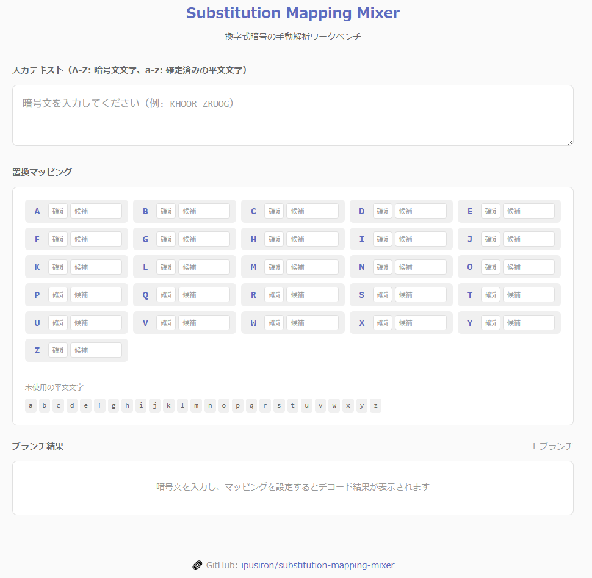

<!--
---
id: day105
slug: substitution-mapping-mixer

title: "Substitution Mapping Mixer"

subtitle_ja: "換字式暗号の手動解析ワークベンチ"
subtitle_en: "Manual substitution-cipher mapping workbench"

description_ja: "換字式暗号の置換表を手動で解析するためのWebツール。確定マッピングと候補マッピングを管理し、複数の仮説をブランチとして比較できます。"
description_en: "A web tool for manually analyzing substitution cipher mapping tables. Manage fixed and candidate mappings, and compare multiple hypotheses as branches."

category_ja:
  - 暗号解析
  - 換字式暗号
category_en:
  - Cryptanalysis
  - Substitution Cipher

difficulty: 2

tags:
  - substitution-cipher
  - monoalphabetic-substitution-cipher
  - cryptanalysis
  - manual-analysis
  - branching
  - ctf-support

repo_url: "https://github.com/ipusiron/substitution-mapping-mixer"
demo_url: "https://ipusiron.github.io/substitution-mapping-mixer/"

hub: true
---
-->

# Substitution Mapping Mixer – 換字式暗号の置換表の手動解析支援ツール


[](https://ipusiron.github.io/substitution-mapping-mixer/)

**Day105 - 生成AIで作るセキュリティツール200**

**Substitution Mapping Mixer** は、換字式暗号（単一換字暗号）の置換表を手動で解析するためのWebツールです。

暗号文文字から平文文字へのマッピングにおいて、確定と候補を管理し、複数の仮説をブランチとして比較できます。
比較の結果から、候補をさらに絞り込むことで、徐々に置換表を完成させられます。

---

## 🌐 デモページ

👉 **[https://ipusiron.github.io/substitution-mapping-mixer/](https://ipusiron.github.io/substitution-mapping-mixer/)**

ブラウザーで直接お試しいただけます。

---

## 📸 スクリーンショット

以下は実際の画面例です。

>
>
> *初期画面*

---

## ✨ 特徴

- **部分マッピングの管理**: 確定した対応と、まだ曖昧な候補を分けて管理
- **ブランチ生成**: 複数の候補からすべての組み合わせを自動生成し、比較可能
- **コンフリクト検出**: 同じ平文文字が複数の暗号文字に割り当てられた場合を視覚的に警告
- **相互ハイライト**: テキストとマッピング表の間でホバー連動
- **完全クライアントサイド**: サーバー通信なし、データはブラウザー内のみ

---

## 📖 使い方

### 入力テキスト

- **A-Z（大文字）**: 暗号文文字（未デコード）
- **a-z（小文字）**: 確定済みの平文文字（ユーザーが直接入力）
- **その他**: そのまま保持

### 置換マッピング

各暗号文字（A-Z）に対して：

| 欄 | 説明 | 例 |
|----|------|-----|
| 確定 | 確定した平文文字（1文字） | `e` |
| 候補 | 可能性のある平文文字（複数可） | `aio` |

- 候補が1つの場合 → 自動的にその候補を採用
- 候補が2つ以上の場合 → すべての組み合わせでブランチを生成

### ブランチ結果

- 各ブランチは候補の組み合わせを示すラベル付き
- ブランチ固有のマッピングはハイライト表示
- マッピングがない文字は大文字のまま表示

---

## 🔗 関連ツール

- **[Frequency Analyzer](https://github.com/ipusiron/frequency-analyzer)** - 頻度分析ツール（Day009）。
  - 換字式暗号の解析前に、文字の出現頻度を調べる際に活用できる。

---

## 🎯 解読例

### 暗号解読ゲーム「Cypher」でSubstitution Mapping Mixerを利用する

- [MONOALPHABETIC SUBSTITUTION PUZZLE 03【Cypher編】](https://akademeia.info/?p=36107)

---

## 📁 ディレクトリー構造

```
substitution-mapping-mixer/
├── index.html          # メインHTMLファイル（CSS/JS含む）
├── README.md           # 本ドキュメント
├── LICENSE             # ライセンスファイル
├── SPEC.md             # 機能仕様書
├── UI_SPEC.md          # UI仕様書
├── CLAUDE.md           # Claude Code用ガイド
├── .gitignore          # Git除外設定
├── .nojekyll           # GitHub Pages設定
└── assets/             # 画像リソース
    └── screenshot.png  # スクリーンショット
```

---

## 📄 ライセンス

- ソースコードのライセンスは `LICENSE` ファイルを参照してください。

---

## 🛠️ このツールについて

本ツールは、「生成AIで作るセキュリティツール200」プロジェクトの一環として開発されました。
このプロジェクトでは、AIの支援を活用しながら、セキュリティに関連するさまざまなツールを100日間にわたり制作・公開していく取り組みを行っています。

プロジェクトの詳細や他のツールについては、以下のページをご覧ください。

🔗 [https://akademeia.info/?page_id=44607](https://akademeia.info/?page_id=44607)
